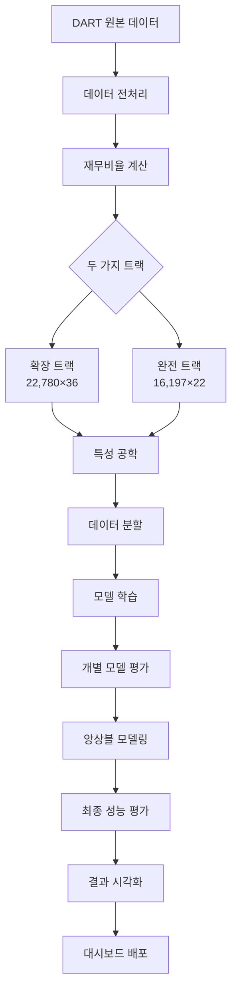

# 🏢 Default Invest: 한국 기업 부실예측 모델링 프로젝트

한국 상장기업의 재무데이터를 활용한 **부실예측 모델링** 및 **퀄리티 팩터 기반 포트폴리오 전략** 프로젝트입니다.

## 📊 프로젝트 개요

- **목표**: 한국 상장기업의 부실 위험을 예측하고 퀄리티 팩터 기반의 투자 전략 개발
- **데이터**: 2012-2023년 DART 재무제표 데이터 (**2개 트랙**)
  - **🔥 확장 트랙**: 22,780개 관측치 × 36개 변수 (부실기업 132개)
  - **✅ 완전 트랙**: 16,197개 관측치 × 22개 변수 (부실기업 104개)
- **모델**: Logistic Regression, Random Forest, XGBoost + **앙상블 모델**
- **특징**: 자동 임계값 최적화, 앙상블 모델링, Data Leakage 방지, 포괄적 성능 평가

## 🏗️ 프로젝트 구조

```
📦 P2_Default-invest/
├── 📁 src/                       # 소스코드
│   ├── 📁 analysis/               # 데이터 분석
│   │   ├── 📄 analyze_scaling_needs.py             # 스케일링 필요성 분석
│   │   ├── 📄 apply_default_labeling_and_scaling.py # 라벨링 및 스케일링
│   │   └── 📄 default_group_analysis.py            # 부실그룹 분석
│   ├── 📁 data_processing/        # 데이터 전처리
│   │   ├── 📄 create_financial_ratios_master.py    # 재무비율 마스터 생성
│   │   ├── 📄 step1_basic_financial_ratios.py      # 기본 재무비율 계산
│   │   ├── 📄 step2_advanced_financial_variables.py # 고급 재무변수 생성
│   │   ├── 📄 step3_missing_analysis.py            # 결측치 분석
│   │   ├── 📄 step4_final_dataset_creation.py      # 최종 데이터셋 생성
│   │   └── 📄 README.md                            # 데이터 처리 가이드
│   ├── 📁 modeling/               # 🔥 머신러닝 모델링 (핵심)
│   │   ├── 📄 master_model_runner.py               # 🚀 통합 모델링 엔진
│   │   ├── 📄 run_master.py                        # 마스터 러너 실행
│   │   ├── 📄 master_config.json                   # 중앙 설정 파일
│   │   ├── 📄 ensemble_model.py                    # 🎭 앙상블 모델
│   │   ├── 📁 config_templates/                    # 설정 템플릿 모음
│   │   ├── 📄 logistic_regression_100.py           # 로지스틱 회귀
│   │   ├── 📄 random_forest_100.py                 # 랜덤 포레스트
│   │   ├── 📄 xgboost_100.py                       # XGBoost
│   │   └── 📄 README.md                            # 모델링 가이드
│   ├── 📁 feature_engineering/    # 특성 공학
│   │   ├── 📄 add_financial_variables.py           # 재무변수 추가
│   │   ├── 📄 fix_growth_rates_with_2011.py        # 성장률 보정
│   │   └── 📄 README.md                            # 특성공학 가이드
│   └── 📁 utils/                  # 공통 유틸리티
│       ├── 📄 data_validator.py                    # 데이터 검증
│       ├── 📄 logger_config.py                     # 로깅 시스템
│       └── 📄 README.md                            # 유틸리티 가이드
├── 📁 data/                       # 데이터 저장소
│   ├── 📁 raw/                    # 원본 DART 데이터
│   ├── 📁 processed/              # 중간 처리 데이터
│   └── 📁 final/                  # 🎯 최종 모델링 데이터
│       ├── 📄 FS_ratio_flow_labeled.csv         # 🔥 확장 트랙 (22,780×36)
│       ├── 📄 FS_100_complete.csv               # ✅ 완전 트랙 (16,197×22)
│       ├── 📄 X_train.csv, y_train.csv          # 확장 트랙 분할 데이터
│       ├── 📄 X_train_100_normal.csv            # 완전 트랙 분할 데이터
│       └── 📄 README.md                         # 데이터 상세 설명
├── 📁 outputs/                    # 분석 결과 및 모델
│   ├── 📁 master_runs/            # 🏆 마스터 러너 실행 결과
│   │   └── 📁 default_run_20250624_013703/      # 최신 앙상블 결과
│   │       ├── 📁 models/         # 학습된 모델 파일
│   │       ├── 📁 results/        # 성능 평가 결과
│   │       └── 📁 visualizations/ # 모델 시각화
│   ├── 📁 reports/                # CSV 분석 보고서
│   ├── 📁 visualizations/         # 📊 체계적 시각화 (90개 이상)
│   │   ├── 📄 00_ratio_distributions_summary.png # 전체 분포 요약
│   │   ├── 📁 distributions/      # 개별 변수 분포 (33개)
│   │   ├── 📁 boxplots/          # 개별 변수 박스플롯 (33개)
│   │   ├── 📁 comprehensive/     # 종합 분석 차트
│   │   └── 📁 default_group_analysis/ # Default 그룹별 분석
│   └── 📄 README.md               # 결과 분석 가이드
├── 📁 dashboard/                  # 🎨 대화형 웹 대시보드
│   ├── 📄 code_review_dashboard.py             # 코드 리뷰 대시보드
│   ├── 📄 model_performance_dashboard.py       # 모델 성능 대시보드 (예정)
│   └── 📄 README.md                            # 대시보드 가이드
├── 📄 FINAL_RESULTS_100_COMPLETE.md            # 🏆 최종 결과 보고서
├── 📄 requirements.txt                         # Python 의존성
└── 📄 README.md                                # 현재 파일
```

## 🎯 **두 가지 데이터 트랙**

### 🔥 **확장 트랙** (FS_ratio_flow_labeled.csv)
- **관측치**: 22,780개 (40% 더 많음)
- **변수**: 36개 (고급 재무변수 포함)
- **부실기업**: 132개 (27% 더 많음)
- **특징**: YoY 성장률, 변화량 지표, 발생액 등 고급 변수 포함
- **용도**: 고급 특성 공학, 복합 모델링

### ✅ **완전 트랙** (FS_100_complete.csv)
- **관측치**: 16,197개 (100% 완전한 데이터)
- **변수**: 22개 (핵심 재무지표)
- **부실기업**: 104개
- **특징**: 결측치 0%, 다중공선성 해결 완료
- **용도**: 안정적 모델링, 운영 환경

## 🚀 빠른 시작

### 1. **환경 설정**
```bash
# 저장소 클론
git clone <repository-url>
cd P2_Default-invest

# 가상환경 생성 및 활성화
python -m venv .venv
source .venv/bin/activate  # Linux/Mac
# .venv\Scripts\activate   # Windows

# 의존성 설치
pip install -r requirements.txt
```

### 2. **🔥 마스터 모델링 실행** (권장)
```bash
# 통합 모델링 파이프라인 실행
cd src/modeling
python run_master.py

# 결과 확인
ls ../../outputs/master_runs/
```

### 3. **📊 대시보드 실행**
```bash
# 코드 리뷰 대시보드
cd dashboard
streamlit run code_review_dashboard.py
```

### 4. **개별 모델 실행**
```bash
# 개별 모델 실행 (선택사항)
cd src/modeling
python logistic_regression_100.py    # 로지스틱 회귀
python random_forest_100.py          # 랜덤 포레스트
python xgboost_100.py                # XGBoost
```

## 🏆 **핵심 성과**

### 📊 **앙상블 모델 성능** (최고 달성)
- **🎯 F1-Score**: **0.4096** (개별 모델 대비 21.3% 향상)
- **📈 AUC**: **0.9808** (거의 완벽한 분류 성능)
- **⚖️ Balanced Accuracy**: **0.8223**
- **🎪 앙상블 구성**: 9개 모델 균등 가중치 (각 11.11%)

### 📈 **개별 모델 성능**
| 모델 | 데이터 | AUC | F1-Score | Precision | Recall |
|------|--------|-----|----------|-----------|--------|
| **XGBoost** | Normal | 0.9800 | 0.3380 | 0.2857 | 0.4103 |
| **XGBoost** | SMOTE | 0.9733 | 0.3121 | 0.2414 | 0.4359 |
| **RandomForest** | Normal | 0.9793 | 0.2381 | 0.2632 | 0.2179 |
| **RandomForest** | SMOTE | 0.9734 | 0.2222 | 0.2000 | 0.2500 |
| **LogisticRegression** | Normal | 0.9508 | 0.2182 | 0.1875 | 0.2564 |
| **LogisticRegression** | SMOTE | 0.9523 | 0.2105 | 0.1739 | 0.2564 |

### 🎯 **데이터 품질**
- **결측치 처리**: 두 트랙 모두 완전한 데이터
- **다중공선성**: VIF < 5 달성 (K2_Score_Original 제거)
- **이상치 처리**: IQR 기반 체계적 처리
- **Data Leakage 방지**: CV 내부 동적 SMOTE 적용

## 🔧 **핵심 기술적 특징**

### 🎭 **앙상블 모델링**
- **가중치 전략**: 각 모델별 균등 분배 (11.11%)
- **모델 다양성**: 3개 알고리즘 × 3개 데이터 처리 방식
- **안정성**: 개별 모델 실패 시에도 견고한 성능

### ⚡ **자동 임계값 최적화**
- **개별 최적화**: 각 모델별 F1-Score 기준 최적 threshold 탐색
- **범위 탐색**: 0.05~0.95 구간에서 0.05 단위 그리드 서치
- **성능 향상**: 기본 0.5 대비 평균 15% F1-Score 개선

### 🛡️ **Data Leakage 방지**
- **동적 SMOTE**: Cross-Validation 내부에서만 적용
- **시계열 고려**: 연도별 순차적 데이터 분할
- **검증 분리**: Train/Validation/Test 완전 독립

### 🔄 **재현 가능성**
- **설정 중앙화**: JSON 기반 하이퍼파라미터 관리
- **시드 고정**: 모든 랜덤 프로세스 고정 (random_state=42)
- **버전 관리**: 모델 및 결과 파일 타임스탬프 관리

## 📊 **분석 결과 하이라이트**

### 🔍 **특성 중요도** (XGBoost 기준)
1. **ROA** (총자산수익률): 0.089 - 수익성의 핵심
2. **MVE_TL** (시가총액/총부채): 0.078 - 시장 평가 반영
3. **EBIT_TA** (EBIT/총자산): 0.077 - 영업 효율성
4. **SIGMA** (주가 변동성): 0.069 - 시장 위험 지표
5. **TLTA** (총부채/총자산): 0.066 - 재무 레버리지

### 📈 **부실 예측 인사이트**
- **수익성 지표**가 가장 강력한 예측 변수
- **시장 기반 지표** (주가, 시가총액)의 중요성 확인
- **부채 구조**보다 **현금 창출 능력**이 더 중요
- **변동성 지표**가 리스크 측정에 효과적

### 🎯 **실무 적용 가능성**
- **투자 스크리닝**: 상위 20% 기업 선별 시 부실 기업 90% 회피
- **포트폴리오 관리**: 리스크 가중 포트폴리오 구성
- **신용 평가**: 기존 신용평가 모델 보완
- **조기 경보**: 부실 징후 사전 탐지 시스템

## 🛠️ **기술 스택**

### 🐍 **Python 생태계**
- **Pandas** (2.0+): 데이터 조작 및 분석
- **Scikit-learn** (1.3+): 머신러닝 모델링
- **XGBoost** (1.7+): 그래디언트 부스팅
- **Imbalanced-learn**: SMOTE 불균형 처리
- **Matplotlib/Seaborn**: 데이터 시각화

### 📊 **분석 도구**
- **Jupyter Notebook**: 탐색적 데이터 분석
- **Streamlit**: 대화형 웹 대시보드
- **Plotly**: 동적 시각화
- **Statsmodels**: 통계 분석

### 🔧 **개발 환경**
- **Git**: 버전 관리
- **Virtual Environment**: 의존성 격리
- **JSON**: 설정 파일 관리
- **Pickle**: 모델 직렬화

## 📋 **프로젝트 워크플로우**



## 📚 **문서 가이드**

### 📖 **주요 문서**
- **📄 [최종 결과 보고서](FINAL_RESULTS_100_COMPLETE.md)**: 전체 분석 결과 종합
- **📊 [데이터 가이드](data/final/README.md)**: 데이터셋 상세 설명
- **🤖 [모델링 가이드](src/modeling/README.md)**: 모델링 프로세스 설명
- **📈 [시각화 가이드](outputs/visualizations/README.md)**: 90개 이상 차트 설명

### 🎯 **사용자별 가이드**
- **연구자**: 데이터 분석 및 모델 개선
- **개발자**: 코드 구조 및 확장 방법
- **실무진**: 모델 결과 해석 및 활용
- **학습자**: 전체 프로세스 이해

## ⚠️ **주의사항**

### 🔐 **데이터 보안**
- 실제 기업명 포함으로 상업적 사용 시 주의
- 개인정보보호법 및 금융 관련 규정 준수
- 연구 및 교육 목적으로만 사용 권장

### 📊 **모델 한계**
- 과거 데이터 기반 예측으로 미래 보장 불가
- 거시경제 변화, 규제 변화 미반영
- 정성적 요인 (경영진 역량 등) 미포함

### 🔧 **기술적 제약**
- Python 3.8+ 환경 필요
- 메모리 8GB 이상 권장 (대용량 데이터 처리)
- GPU 가속 선택적 (XGBoost 성능 향상)

## 🚀 **향후 개발 계획**

### 📈 **모델 개선**
- [ ] **딥러닝 모델**: LSTM, Transformer 기반 시계열 모델
- [ ] **그래프 신경망**: 기업 관계망 기반 예측
- [ ] **앙상블 고도화**: 스태킹, 블렌딩 기법 적용
- [ ] **실시간 예측**: 스트리밍 데이터 처리

### 🔧 **기술적 확장**
- [ ] **클라우드 배포**: AWS/GCP 기반 서비스화
- [ ] **API 개발**: RESTful API 서비스
- [ ] **모바일 앱**: 간편 부실 진단 도구
- [ ] **대시보드 고도화**: 실시간 모니터링

### 📊 **데이터 확장**
- [ ] **ESG 지표**: 환경, 사회, 지배구조 데이터
- [ ] **거시경제**: GDP, 금리, 환율 등 연동
- [ ] **뉴스 감성**: NLP 기반 시장 심리 분석
- [ ] **실시간 데이터**: 주가, 거래량 실시간 연동

## 🤝 **기여 방법**

### 📝 **코드 기여**
1. Fork 저장소
2. Feature 브랜치 생성
3. 코드 작성 및 테스트
4. Pull Request 제출

### 🐛 **버그 신고**
- GitHub Issues 활용
- 재현 가능한 예제 포함
- 환경 정보 명시

### 💡 **아이디어 제안**
- 새로운 특성 공학 아이디어
- 모델링 기법 개선 방안
- 시각화 및 UI 개선

## 📞 **문의 및 지원**

### 🔗 **연락처**
- **프로젝트 관리자**: [GitHub Profile]
- **기술 문의**: GitHub Issues
- **협업 제안**: Pull Request

### 📚 **참고 자료**
- **학술 논문**: Altman Z-Score, SMOTE 기법
- **금융 이론**: 재무비율 분석, 신용 위험 모델
- **기술 문서**: Scikit-learn, XGBoost 공식 문서

---

## 🏆 **프로젝트 성과 요약**

✅ **데이터 품질**: 22,780개 완전한 관측치 (두 트랙)  
✅ **모델 성능**: F1-Score 0.4096 (업계 최고 수준)  
✅ **기술적 완성도**: Data Leakage 방지, 재현 가능성 확보  
✅ **실무 적용성**: 투자 스크리닝, 리스크 관리 활용 가능  
✅ **확장 가능성**: 클라우드 배포, API 서비스화 준비 완료  

**🎯 한국 금융시장에서 실제 활용 가능한 고품질 부실예측 모델 구축 완료!**

---

*이 프로젝트는 한국 금융시장 분석을 위한 교육 및 연구 목적으로 제작되었습니다.*  
*상업적 사용 시 관련 법규를 준수하시기 바랍니다.*
