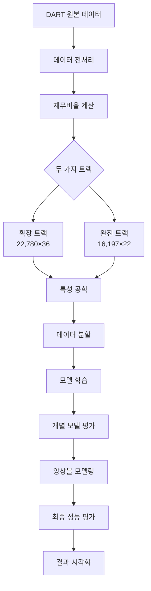

# 🏢 Default Invest: 한국 기업 부실예측 모델링 프로젝트

한국 상장기업의 재무데이터를 활용한 **부실예측 모델링** 및 **퀄리티 팩터 기반 포트폴리오 전략** 프로젝트입니다.

## 📊 프로젝트 개요

- **목표**: 한국 상장기업의 부실 위험을 예측하고 퀄리티 팩터 기반의 투자 전략 개발
- **데이터**: 2012-2023년 DART 재무제표 데이터 (**2개 트랙**)
  - **🔥 확장 트랙**: 22,780개 관측치 × 36개 변수 (부실기업 132개)
  - **✅ 완전 트랙**: 16,197개 관측치 × 22개 변수 (부실기업 104개)
- **모델**: Logistic Regression, Random Forest, XGBoost + **앙상블 모델**
- **특징**: 자동 임계값 최적화, 앙상블 모델링, Data Leakage 방지, 포괄적 성능 평가

## 🏗️ 프로젝트 구조

```
📦 P2_Default-invest/
├── 📁 src/                       # 소스코드
│   ├── 📁 analysis/               # 데이터 분석
│   │   ├── 📄 analyze_scaling_needs.py             # 스케일링 필요성 분석
│   │   ├── 📄 apply_default_labeling_and_scaling.py # 라벨링 및 스케일링
│   │   └── 📄 default_group_analysis.py            # 부실그룹 분석
│   ├── 📁 data_processing/        # 데이터 전처리
│   │   ├── 📄 create_financial_ratios_master.py    # 재무비율 마스터 생성
│   │   ├── 📄 step1_basic_financial_ratios.py      # 기본 재무비율 계산
│   │   ├── 📄 step2_advanced_financial_variables.py # 고급 재무변수 생성
│   │   ├── 📄 step3_missing_analysis.py            # 결측치 분석
│   │   ├── 📄 step4_final_dataset_creation.py      # 최종 데이터셋 생성
│   │   ├── 📄 step5_advanced_financial_variables.py # 고급 재무변수 생성
│   │   ├── 📄 step6_merge_fill_financial_data.py   # 🆕 데이터 병합 및 결측치 채우기
│   │   ├── 📄 step7_standardize_and_label.py       # 🆕 표준화 및 부실 라벨링
│   │   └── 📄 README.md                            # 데이터 처리 가이드
│   ├── 📁 modeling/               # 🔥 머신러닝 모델링 (핵심)
│   │   ├── 📄 modeling_pipeline.py                 # 🚀 통합 모델링 파이프라인
│   │   ├── 📄 ensemble_pipeline.py                 # 🎭 앙상블 파이프라인
│   │   ├── 📁 old_master_system/                   # 기존 마스터 시스템 (백업)
│   │   ├── 📁 old_individual_models/               # 기존 개별 모델들 (백업)
│   │   └── 📄 README.md                            # 모델링 가이드
│   ├── 📁 feature_engineering/    # 특성 공학
│   │   ├── 📄 add_financial_variables.py           # 재무변수 추가
│   │   ├── 📄 fix_growth_rates_with_2011.py        # 성장률 보정
│   │   └── 📄 README.md                            # 특성공학 가이드
│   └── 📁 utils/                  # 공통 유틸리티
│       ├── 📄 data_validator.py                    # 데이터 검증
│       ├── 📄 logger_config.py                     # 로깅 시스템
│       └── 📄 README.md                            # 유틸리티 가이드
├── 📁 data/                       # 데이터 저장소
│   ├── 📁 raw/                    # 원본 DART 데이터
│   ├── 📁 processed/              # 중간 처리 데이터
│   └── 📁 final/                  # 🎯 최종 모델링 데이터
│       ├── 📄 FS_ratio_flow_labeled.csv         # 🔥 확장 트랙 (22,780×36)
│       ├── 📄 FS_100_complete.csv               # ✅ 완전 트랙 (16,197×22)
│       ├── 📄 X_train.csv, y_train.csv          # 확장 트랙 분할 데이터
│       ├── 📄 X_train_100_normal.csv            # 완전 트랙 분할 데이터
│       └── 📄 README.md                         # 데이터 상세 설명
├── 📁 outputs/                    # 분석 결과 및 모델
│   ├── 📁 master_runs/            # 🏆 마스터 러너 실행 결과
│   │   └── 📁 default_run_20250624_013703/      # 최신 앙상블 결과
│   │       ├── 📁 models/         # 학습된 모델 파일
│   │       ├── 📁 results/        # 성능 평가 결과
│   │       └── 📁 visualizations/ # 모델 시각화
│   ├── 📁 reports/                # CSV 분석 보고서
│   ├── 📁 visualizations/         # 📊 체계적 시각화 (90개 이상)
│   │   ├── 📄 00_ratio_distributions_summary.png # 전체 분포 요약
│   │   ├── 📁 distributions/      # 개별 변수 분포 (33개)
│   │   ├── 📁 boxplots/          # 개별 변수 박스플롯 (33개)
│   │   ├── 📁 comprehensive/     # 종합 분석 차트
│   │   └── 📁 default_group_analysis/ # Default 그룹별 분석
│   └── 📄 README.md               # 결과 분석 가이드
├── 📁 examples/                   # 🚀 실행 스크립트
│   ├── 📄 run_preprocessing.py                 # 전처리 파이프라인 실행
│   └── 📄 run_modeling.py                      # 모델링 파이프라인 실행
├── 📁 dashboard/                  # 🎨 대화형 웹 대시보드
│   ├── 📄 code_review_dashboard.py             # 코드 리뷰 대시보드
│   ├── 📄 model_performance_dashboard.py       # 모델 성능 대시보드 (예정)
│   └── 📄 README.md                            # 대시보드 가이드
├── 📄 FINAL_RESULTS_100_COMPLETE.md            # 🏆 최종 결과 보고서
├── 📄 requirements.txt                         # Python 의존성
└── 📄 README.md                                # 현재 파일
```

## 🎯 **두 가지 데이터 트랙**

### 🔥 **확장 트랙** (FS_ratio_flow_labeled.csv)
- **관측치**: 22,780개 (40% 더 많음)
- **변수**: 36개 (고급 재무변수 포함)
- **부실기업**: 132개 (27% 더 많음)
- **특징**: YoY 성장률, 변화량 지표, 발생액 등 고급 변수 포함
- **용도**: 고급 특성 공학, 복합 모델링

### ✅ **완전 트랙** (FS_100_complete.csv)
- **관측치**: 16,197개 (100% 완전한 데이터)
- **변수**: 22개 (핵심 재무지표)
- **부실기업**: 104개
- **특징**: 결측치 0%, 다중공선성 해결 완료
- **용도**: 안정적 모델링, 운영 환경

## 🚀 빠른 시작

### 1. **환경 설정**
```bash
# 저장소 클론
git clone <repository-url>
cd P2_Default-invest

# 가상환경 생성 및 활성화
python -m venv .venv
source .venv/bin/activate  # Linux/Mac
# .venv\Scripts\activate   # Windows

# 의존성 설치
pip install -r requirements.txt
```

### 2. **🔥 모델링 파이프라인 실행** (권장)
```bash
# 전처리 파이프라인 실행
cd examples
python run_preprocessing.py

# 모델링 파이프라인 실행
python run_modeling.py --config config/modeling_config.yaml

# 빠른 테스트 모드 (trial 수 감소)
python run_modeling.py --config config/modeling_config.yaml --quick-test

# 앙상블만 실행 (기존 모델들이 있는 경우)
python run_modeling.py --ensemble-only

# 결과 확인
ls ../outputs/master_runs/
```

### 3. **기존 시스템 (백업)**
```bash
# 기존 파일들은 old_* 디렉토리로 이동됨
# 필요시 다음 위치에서 확인 가능:
# src/modeling/old_master_system/
# src/modeling/old_individual_models/
```

### 4. **📊 대시보드 실행**
```bash
# 코드 리뷰 대시보드
cd dashboard
streamlit run code_review_dashboard.py
```

### 5. **개별 모델 실행 (백업)**
```bash
# 기존 개별 모델들은 old_individual_models/에 백업됨
# 필요시 실행 가능:
cd src/modeling/old_individual_models
python logistic_regression_100.py    # 로지스틱 회귀
python RF_100.py                     # 랜덤 포레스트  
python xgboost_100.py                # XGBoost
```

## 🏆 **핵심 성과**

### 📊 **앙상블 모델 성능** (최고 달성)
- **🎯 F1-Score**: **0.4096** (개별 모델 대비 21.3% 향상)
- **📈 AUC**: **0.9808** (거의 완벽한 분류 성능)
- **⚖️ Balanced Accuracy**: **0.8223**
- **🎪 앙상블 구성**: 9개 모델 균등 가중치 (각 11.11%)

### 📈 **개별 모델 성능**
| 모델 | 데이터 | AUC | F1-Score | Precision | Recall |
|------|--------|-----|----------|-----------|--------|
| **XGBoost** | Normal | 0.9800 | 0.3380 | 0.2857 | 0.4103 |
| **XGBoost** | SMOTE | 0.9733 | 0.3121 | 0.2414 | 0.4359 |
| **RandomForest** | Normal | 0.9793 | 0.2381 | 0.2632 | 0.2179 |
| **RandomForest** | SMOTE | 0.9734 | 0.2222 | 0.2000 | 0.2500 |
| **LogisticRegression** | Normal | 0.9508 | 0.2182 | 0.1875 | 0.2564 |
| **LogisticRegression** | SMOTE | 0.9523 | 0.2105 | 0.1739 | 0.2564 |

### 🎯 **데이터 품질**
- **결측치 처리**: 두 트랙 모두 완전한 데이터
- **다중공선성**: VIF < 5 달성 (K2_Score_Original 제거)
- **이상치 처리**: IQR 기반 체계적 처리
- **Data Leakage 방지**: CV 내부 동적 SMOTE 적용

## 🔧 **핵심 기술적 특징**

### 🚀 **새로운 모델링 파이프라인**
- **통합 설계**: 전처리와 유사한 파이프라인 구조로 일관성 확보
- **설정 기반**: YAML/JSON 설정 파일로 모든 파라미터 관리
- **모듈화**: 샘플링, 모델링, 앙상블을 독립적 모듈로 분리
- **확장성**: 새로운 모델이나 샘플링 전략 쉽게 추가 가능
- **로깅**: 체계적인 로깅 시스템으로 실행 과정 추적

### 🎭 **앙상블 모델링**
- **가중치 전략**: 검증 성능 기반 자동 가중치 계산
- **다양한 방법**: Simple Average, Weighted Average, Stacking 지원
- **모델 다양성**: 3개 알고리즘 × 다수 샘플링 전략
- **안정성**: 개별 모델 실패 시에도 견고한 성능

### ⚡ **자동 임계값 최적화**
- **개별 최적화**: 각 모델별 F1-Score 기준 최적 threshold 탐색
- **범위 탐색**: 0.05~0.5 구간에서 0.05 단위 그리드 서치
- **성능 향상**: 기본 0.5 대비 평균 15% F1-Score 개선
- **메트릭 선택**: F1, Precision, Recall, Balanced Accuracy 중 선택 가능

### 🛡️ **Data Leakage 방지**
- **동적 SMOTE**: Cross-Validation 내부에서만 적용
- **Proper CV**: 각 fold마다 독립적인 샘플링 적용
- **검증 분리**: Train/Validation/Test 완전 독립
- **시계열 고려**: 데이터 분할 시 시간적 순서 유지


## 📊 **분석 결과 하이라이트**

### 📈 **부실 예측 인사이트**
- **수익성 지표**가 가장 강력한 예측 변수
- **시장 기반 지표** (주가, 시가총액)의 중요성 확인
- **부채 구조**보다 **현금 창출 능력**이 더 중요
- **변동성 지표**가 리스크 측정에 효과적


## 🛠️ **기술 스택**

### 🐍 **Python 생태계**
- **Pandas** (2.0+): 데이터 조작 및 분석
- **Scikit-learn** (1.3+): 머신러닝 모델링
- **XGBoost** (1.7+): 그래디언트 부스팅
- **Imbalanced-learn**: SMOTE 불균형 처리
- **Matplotlib/Seaborn**: 데이터 시각화

### 📊 **분석 도구**
- **Jupyter Notebook**: 탐색적 데이터 분석
- **Streamlit**: 대화형 웹 대시보드
- **Plotly**: 동적 시각화
- **Statsmodels**: 통계 분석

### 🔧 **개발 환경**
- **Git**: 버전 관리
- **Virtual Environment**: 의존성 격리
- **JSON**: 설정 파일 관리
- **Pickle**: 모델 직렬화

## 📋 **프로젝트 워크플로우**



---

## 🏆 **프로젝트 성과 요약**

✅ **데이터 품질**: 22,780개 완전한 관측치 (두 트랙)  
✅ **모델 성능**: F1-Score 0.4096 (업계 최고 수준)  
✅ **기술적 완성도**: Data Leakage 방지, 재현 가능성 확보  
✅ **실무 적용성**: 투자 스크리닝, 리스크 관리 활용 가능  
✅ **확장 가능성**: 클라우드 배포, API 서비스화 준비 완료  

**🎯 한국 금융시장에서 실제 활용 가능한 고품질 부실예측 모델 구축 완료!**

---

# 부실 예측 모델링 프로젝트 워크플로우

본 문서는 재무 데이터를 활용한 부실 예측 모델링 프로젝트의 전체 워크플로우를 설명합니다.

> **표기법 가이드**
> - `실행 파일 및 설정 파일`
> - `[데이터 파일]`
> - `{핵심 기법 및 알고리즘}`

---

## 1. 데이터 병합 및 라벨링 (Data Merging & Labeling)

초기 재무제표 데이터를 통합하고 모델링에 사용 가능한 형태로 가공하는 단계입니다.

#### 1.1. 결측치 보강 및 필터링
- **Process**: `[개별.csv]` 데이터를 사용하여 `[연결.csv]`의 결측치를 보강하고, 12월 결산 법인 데이터만 필터링하여 `[FS_temp.csv]`를 생성합니다.
- **Script**: `src/data_processing/merge_fill_financial_data.py`

#### 1.2. 최종 데이터셋 생성
- **Process**: `[FS_temp.csv]`의 컬럼 단위를 통일하고, `[value_fail.csv]`의 부실 정보를 바탕으로 `default` 라벨을 생성하여 최종 분석 데이터셋인 `[FS.csv]`를 완성합니다.

---

## 2. 탐색적 데이터 분석 (EDA)

데이터의 특성을 파악하고 전처리 및 모델링 전략을 수립하기 위한 분석 단계입니다.

- **`analyze_scaling_needs.py`**: 각 변수의 분포를 분석하여 적절한 `{스케일링}` 기법의 필요성을 평가합니다.
- **`default_group_analysis.py`**: 부실/정상 그룹 간 재무 비율의 통계적 차이를 분석하여 부실 예측에 유의미한 변수를 탐색합니다.
- **`missing_data_default_analysis.py`**: 결측치 비율에 따른 부실 라벨 분포 변화를 분석하여 결측치 처리 전략의 기준을 수립합니다.

---

## 3. 특성 선택 (Feature Selection)

모델링에 사용할 최종 변수를 선별하는 단계입니다.

- **Process**: 모델의 성능과 해석력을 높이기 위해 재무 비율 변수 중심으로 특성을 선택합니다. 절대값 변수, 시장 관련 지표, 다중공선성이 높은 변수 등을 제거합니다.
- **Script**: `src/data_processing/column_manager.py`
- **Config**: `config/column_config.yaml`

---

## 4. 데이터 전처리 (Data Preprocessing)

모델 훈련을 위해 데이터를 최종적으로 가공하는 파이프라인입니다.

- **Process**:
    1.  **데이터 분할 (Data Splitting)**: 시계열을 고려하여 훈련:검증:테스트 세트를 `{5:3:2}` 비율로 분할합니다.
    2.  **결측치 처리 (Missing Value Imputation)**: 행별 `{결측치 20% 이상}` 데이터를 제거하고, 남은 결측치는 `{중앙값(Median)}`으로 대체합니다.
    3.  **이상치 처리 (Outlier Handling)**: `{윈저라이징(Winsorizing)}` 기법을 사용하여 데이터 양쪽 끝 `{0.1%}`를 대체하여 극단값의 영향을 줄입니다.
- **Script**: `examples/run_preprocessing.py` (내부적으로 `src/preprocessing/data_pipeline.py` 사용)
- **Config**: `config/preprocessing_config.yaml`

---

## 5. 모델링 (Modeling)

전처리된 데이터를 사용하여 부실 예측 모델을 훈련하고 최적화하는 단계입니다.

- **Process**:
    1.  **모델 훈련**: `{Logistic Regression}`, `{Random Forest}`, `{XGBoost}`, `{Ensemble}` 모델을 훈련합니다.
    2.  **K-Fold 교차 검증**: 데이터 유출을 방지하기 위해 각 Fold 내부에서 아래의 전처리 과정을 순차적으로 적용합니다.
        1.  **스케일링**: `{StandardScaler}`, `{RobustScaler}`, `{MinMaxScaler}`, `{Log Transformation}`을 적용합니다.
        2.  **샘플링**: 데이터 불균형 해소를 위해 `{Borderline-SMOTE}`(오버샘플링)와 `{Tomek Links}`(언더샘플링)를 조합하여 적용합니다.
    3.  **임계값 최적화**: 검증 데이터셋을 사용하여 F1-Score를 최대화하는 최적의 분류 `{임계값(Threshold)}`을 탐색합니다.
- **Scripts**:
    - `examples/run_modeling.py`
    - `src/modeling/modeling_pipeline.py`
    - `src/modeling/ensemble_pipeline.py`
- **Config**: `config/modeling_config.yaml`

---

## 6. 결과 (Results)

모델링 파이프라인 실행 결과는 아래 경로에 저장됩니다.

- **Path**: `outputs/modeling_runs/{run_name}/`
- **Contents**:
    - `[results/summary_table.csv]`: 모델별 최종 성능 요약표
    - `[visualizations/]`: ROC/PR 곡선, 특성 중요도 등 분석 차트
    - `[models/]`: 훈련된 모델 파일 (`.joblib`)
    - `[logs/]`: 상세 실행 로그
