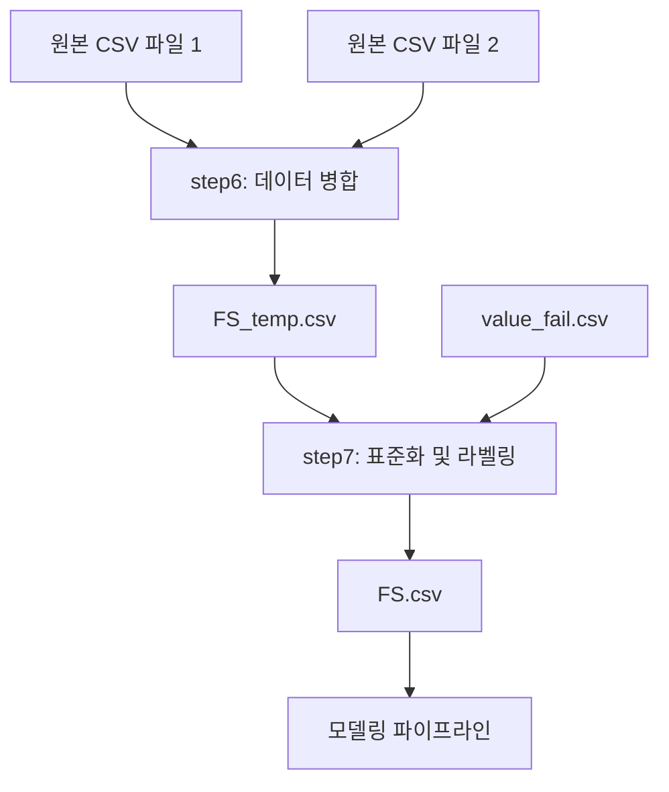

# 데이터 처리 가이드

이 디렉토리는 재무데이터 전처리 및 변환을 위한 스크립트들을 포함합니다.

## 📋 스크립트 목록

### 🔧 기존 스크립트
- **`step5_advanced_financial_variables.py`** - 고급 재무변수 생성

### 🆕 새로운 스크립트

#### **`step6_merge_fill_financial_data.py`** - 재무데이터 병합 및 결측치 채우기
두 개의 CSV 파일을 병합하여 결측치를 채우는 스크립트입니다.

**기능:**
- 두 CSV 파일을 ['거래소코드', '회계년도'] 기준으로 병합
- 첫 번째 CSV의 결측치를 두 번째 CSV 데이터로 채움  
- 컬럼명 자동 매칭 (예: 자산(IFRS연결)(천원) ↔ 자산(IFRS)(천원))
- 두 번째 파일에만 있는 컬럼 추가
- 12월 회계년도만 필터링
- 결과를 `data/processed/FS_temp.csv`로 저장

**사용법:**
```bash
# 기본 실행 (파일 경로를 코드에서 수정하세요)
python step6_merge_fill_financial_data.py

# 파일 경로 지정
python step6_merge_fill_financial_data.py --primary data/raw/파일1.csv --secondary data/raw/파일2.csv
```

**커스터마이징:**
- 코드 내 `column_mapping` 딕셔너리에서 수동 컬럼 매칭 추가/수정
- 자동 매칭이 부정확한 경우 수동으로 보완

#### **`step7_standardize_and_label.py`** - 재무데이터 표준화 및 부실 라벨링
재무데이터의 컬럼명을 표준화하고 부실 기업 라벨을 생성하는 스크립트입니다.

**기능:**
- 컬럼명 표준화 (단위 제거, 이름 간략화)
- 단위 통일 (원, 천원, 백만원, 십억원 → 원 기준)
  - 천원 × 1000 = 원
  - 백만원 × 1000000 = 원  
  - 십억원 × 1000000000 = 원
- `value_fail.csv`와 매칭하여 부실 라벨링
- 폐지일자 기준 t-1년에 부실 라벨 부여 (없으면 t-2, t-3년 순서로)
- 부실 기업의 라벨이 부여된 년도 외 데이터 제거
- 결과를 `data/processed/FS.csv`로 저장

**사용법:**
```bash
# 기본 실행
python step7_standardize_and_label.py

# 파일 경로 지정
python step7_standardize_and_label.py --fs-temp data/processed/FS_temp.csv --value-fail data/raw/value_fail.csv
```

**커스터마이징:**
- 코드 내 `column_standardization` 딕셔너리에서 컬럼명 표준화 규칙 추가/수정
- `unit_conversion` 딕셔너리에서 새로운 단위 변환 규칙 추가

## 🔄 워크플로우



## 📝 주의사항

1. **파일 경로 설정**: 실제 데이터 파일 경로에 맞게 코드 내 기본값을 수정하세요
2. **컬럼 매칭**: 자동 매칭이 부정확한 경우 수동 매핑 딕셔너리를 수정하세요  
3. **단위 변환**: 새로운 단위가 있는 경우 변환 규칙을 추가하세요
4. **데이터 검증**: 각 단계별로 결과를 확인하고 검증하세요

## 🛠️ 의존성

- pandas
- numpy  
- pathlib
- logging
- re (정규표현식)

## 📊 예상 결과

- **step6 결과**: `data/processed/FS_temp.csv`
  - 두 파일이 병합된 완전한 재무데이터
  - 12월 회계년도만 포함
  - 결측치가 최대한 채워진 상태

- **step7 결과**: `data/processed/FS.csv`  
  - 표준화된 컬럼명 (간결하고 일관된 이름)
  - 통일된 단위 (모든 금액이 원 기준)
  - 부실 라벨이 있는 최종 모델링용 데이터